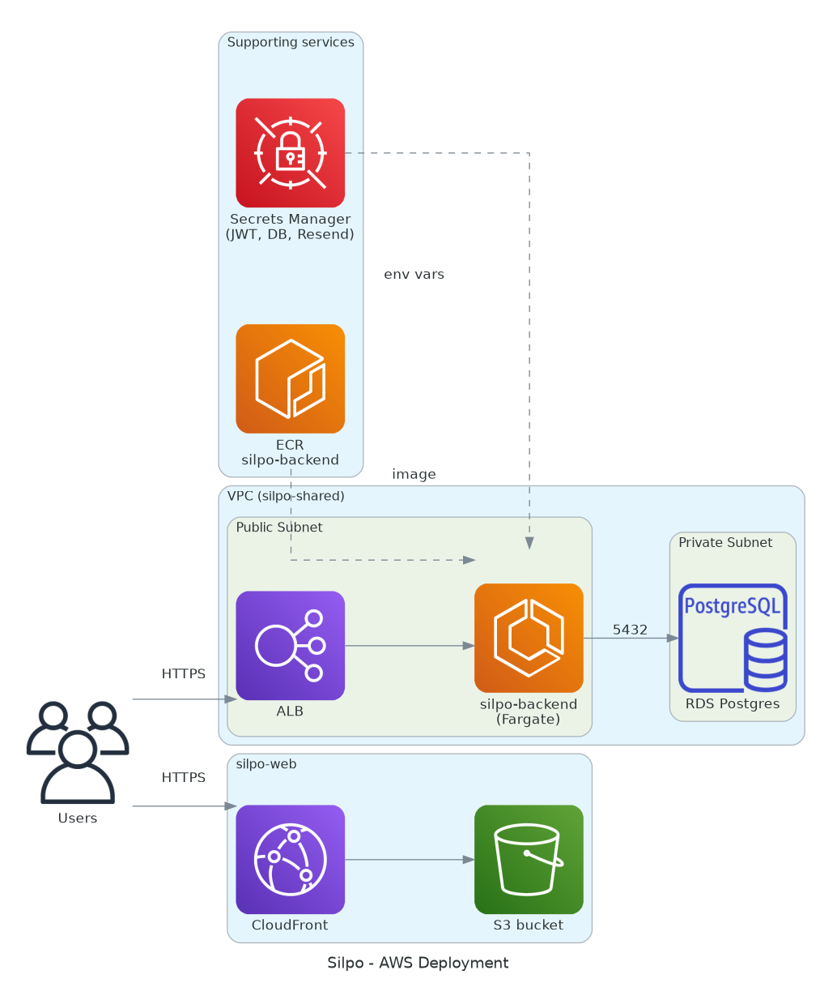

# silpo-iac

Infrastructure as Code for the Silpo project on AWS, using **OpenTofu** (reusable modules,
Terraform-compatible HCL) + **Terragrunt** (environment wiring, remote state, DRY provider
config — Terragrunt 1.x runs OpenTofu by default).

> Traffic assumption driving every default here: at most 3-4 concurrent users, and close to zero
> traffic for ~99% of the day. Every choice below optimizes for that — see
> [Cost trade-offs](#cost-trade-offs).

## Architecture



Generated by [`docs/architecture/diagram.py`](docs/architecture/diagram.py) — kept up to date by
the CI `Diagram` job (see [CI/CD](#cicd)), not by hand.

## Stack

| Layer               | Technology                                      |
| ------------------- | ------------------------------------------------ |
| IaC                 | OpenTofu + Terragrunt                            |
| Cloud               | AWS                                              |
| Compute             | ECS Fargate (single task) + Application Load Balancer |
| Web hosting         | S3 + CloudFront (static SPA, `silpo-web`)        |
| Database            | RDS PostgreSQL (single-AZ, `db.t4g.micro`)       |
| Container registry  | ECR                                              |
| Secrets             | AWS Secrets Manager                              |
| Linting             | `tofu fmt`, `terragrunt hcl fmt`, TFLint         |
| Security scanning   | tfsec                                            |
| Pre-commit hooks    | [pre-commit](https://pre-commit.com) + pre-commit-terraform |
| CI                  | GitHub Actions                                   |

## Repository layout

```
terraform/
  modules/
    networking/    # VPC, public/private subnets, optional NAT gateway
    ecr/            # Container registry for the silpo-backend image
    rds-postgres/   # RDS instance + Secrets Manager secret with connection details
    ecs-service/    # ECS cluster, Fargate service, ALB, task's own app secrets (JWT/Resend)
    static-site/    # S3 bucket + CloudFront distribution for a static SPA (silpo-web)
terragrunt/
  terragrunt.hcl    # Root config: S3 remote state (native locking) + AWS provider generation
  live/
    shared/         # The one environment this project runs (see "Environments" below)
      env.hcl       # account_id / aws_region / environment name
      networking/
      ecr/
      rds/
      api/
      web/
```

`silpo-mobile` (Expo/React Native) has no unit here — it isn't deployed to AWS. Distribution goes
through the app stores, and builds/OTA updates through Expo's own EAS service.

## Environments

This project runs a **single environment** (`shared`), not separate `dev`/`staging`/`prod` stacks.
Running a full second copy (ALB + RDS + Fargate) would roughly double the fixed monthly cost for
a project with this little traffic, so it wasn't worth it. If that changes (e.g. real users,
need for a safe place to test destructive changes), copy `terragrunt/live/shared/` to a new
`terragrunt/live/<name>/` folder with its own `env.hcl` — every module already supports it.

## Cost trade-offs

Defaults here explicitly trade a bit of resilience/observability for a lower, mostly-fixed bill:

- **No NAT gateway** (`enable_nat_gateway = false` in `networking`). A NAT gateway costs ~US$32-38/month
  just sitting idle — often more than the rest of this stack combined at this traffic level. Instead,
  the ECS Fargate task runs in the **public** subnets with a public IP (`assign_public_ip = true` in
  the `api` unit). This does *not* expose the app directly: the task's security group only allows
  inbound traffic from the ALB's security group, so a public IP on the task doesn't make it reachable
  from the internet. RDS stays in the private subnets and never needs outbound internet access, so it
  doesn't need NAT either.
- **Single-AZ RDS**, `db.t4g.micro`, no read replica. Enough for a handful of users; `multi_az = true`
  would double the RDS cost for redundancy this project doesn't need yet.
- **Smallest Fargate task** (256 CPU units / 512 MiB), `desired_count = 1`. No autoscaling — one task
  is enough for a handful of concurrent users, and it's the cheapest way to keep the API always
  reachable (Fargate bills per second while running, so this is the actual cost floor, not a burst
  limit).
- **Container Insights disabled** by default (`enable_container_insights = false` in `ecs-service`) —
  it adds CloudWatch metrics cost for observability this project doesn't need day to day.
- **`silpo-web` on S3 + CloudFront** (`static-site` module), not another Fargate service. Static
  hosting bills per request/GB served, not per second of uptime — at this traffic it's cents/month,
  not another ~US$20-30 of always-on compute. `PriceClass_100` (North America + Europe edge
  locations only) keeps it cheap; WAF and access logging are left off for the same cost reason.

**Rough always-on monthly estimate** (`us-east-1`, on-demand pricing, excluding AWS free tier which
likely covers most of this in year one): ALB ~US$18 (fixed) + RDS ~US$15 (instance + storage) +
Fargate ~US$9 (1 task, 256/512) + Secrets Manager/CloudWatch/ECR ~US$2 + S3/CloudFront (`web` unit)
~US$1 ≈ **US$40-45/month**, still dominated by the ALB.

**If you need to go lower than that**: the only way to actually get near US$0 during idle hours is to
stop running the API 24/7 — e.g. port `silpo-backend` to run on AWS Lambda (behind API Gateway
instead of an ALB, using an ASGI adapter like [Mangum](https://github.com/jordaneremieff/mangum)) so
you pay per request instead of per second of uptime. That's a `silpo-backend` code change, not just
infra, so it's deliberately out of scope here — flag it if the AWS bill becomes worth optimizing
further.

## Prerequisites

- [OpenTofu](https://opentofu.org/docs/intro/install/) `>= 1.7` (Terragrunt invokes `tofu` by
  default; a Terraform CLI install works too, but then pass `--tf-path terraform` to every
  Terragrunt command)
- [Terragrunt](https://terragrunt.gruntwork.io/docs/getting-started/install/) `>= 1.0`
- [TFLint](https://github.com/terraform-linters/tflint) (optional locally, runs in CI)
- AWS credentials with permission to create the resources in `terraform/modules/*`

## One-time bootstrap

1. **Set the real AWS account ID.** Edit `terragrunt/live/shared/env.hcl` and replace the
   placeholder `account_id`. This namespaces the Terraform state bucket
   (`silpo-terraform-state-<account_id>`) so it doesn't collide with anyone else's AWS account.
2. **Set the real Resend API key.** Terraform can't invent a real third-party API key, so it's
   not a committed input:
   ```bash
   cp terragrunt/live/shared/api/secrets.tfvars.example terragrunt/live/shared/api/secrets.tfvars
   ```
   Edit `secrets.tfvars` (git-ignored) and fill in the real key. Skipping this step is fine —
   `resend_api_key` defaults to an empty string — but email sending won't work until it's set
   and the `api` unit is re-applied.
3. **Apply.** The `--backend-bootstrap` flag has Terragrunt create the S3 state bucket
   automatically if it doesn't exist yet (state locking uses S3's own native locking, no
   DynamoDB table needed) — no separate bootstrap step:
   ```bash
   cd terragrunt/live/shared
   terragrunt apply --all --backend-bootstrap
   ```
   Terragrunt resolves the dependency order itself: `networking` → `ecr`/`rds` → `api`.
4. **Push an image.** The `ecr` unit's output (`repository_url`) is where `silpo-backend`'s CI
   should push images. The `api` unit currently deploys the `:latest` tag; wiring a real
   build-and-deploy pipeline in `silpo-backend` is a natural next step.
5. **Deploy the web build.** The `web` unit only provisions the bucket and distribution — it
   doesn't build or upload `silpo-web`. After building it there:
   ```bash
   aws s3 sync dist/ s3://<web unit's bucket_name output> --delete
   aws cloudfront create-invalidation --distribution-id <web unit's distribution_id output> --paths "/*"
   ```
   Wiring this into `silpo-web`'s own CI is a natural next step, same as the backend's image push.

## CI/CD

`.github/workflows/ci.yml` runs on every push and pull request:

- **Lint** — `tofu fmt -check`, `terragrunt hcl fmt --check`, TFLint
- **Test** — `tofu validate` per module (no AWS credentials needed) + `tfsec` security scan
- **Diagram** — renders [`docs/architecture/diagram.py`](docs/architecture/diagram.py) (Python
  [`diagrams`](https://diagrams.mingrammer.com/) library, official AWS icons) into
  `docs/architecture/architecture.png` (the image embedded above), no AWS credentials needed
  since it's hand-described, not derived from a live plan. Runs after (`needs:`) `Lint` and
  `Test` have already passed for the same commit. Not itself a required status check —
  informational only. Runs (render + artifact + job summary) on every push and PR, but only
  self-commits on `push` to **`develop`** — never `main`. `main` only ever changes through a
  manually-reviewed `develop -> main` PR that someone merges themselves (see
  [Branching](#branching)); letting this bot commit to `main` independently was tried and
  reverted, since a bot-authored fix landing only on `main` is exactly how `main` and `develop`
  end up with diverging history (it happened once while building this — see the `50ee178`/
  `8a27250` commits in the repo history for what that looked like).

  On a qualifying push to `develop`, if the rendered image differs from the one committed, it
  opens a PR with the refresh — authenticated as `DIAGRAM_BOT_TOKEN` (a fine-grained PAT scoped
  to just this repo, belonging to a user in `bypass_pull_request_allowances`) instead of the
  default `GITHUB_TOKEN`, since the built-in token can't trigger `pull_request` workflows on a PR
  it opens itself (GitHub's own loop-prevention) — and then immediately merges that PR itself
  with an admin override (`gh pr merge --admin`). That's the one specific case in this repo that
  merges into a protected branch without a human clicking approve; "gated on checks" here means
  the merge step is only reached once `Lint`/`Test` succeeded on the original commit, not that
  GitHub's own protections are checked again for the PR — the admin override skips those outright
  (a plain `--auto` merge doesn't work for this: bypassing the required-review count only applies
  to a direct push or an explicit admin-override merge, not to GitHub's passive
  merge-when-checks-pass queue — confirmed by hitting exactly that wall while building this).
  Update `diagram.py` itself by hand alongside any change to what's actually provisioned; the
  image on `develop` follows automatically on the next push, and reaches `main` the same way
  everything else does — via the next manual promotion.

  **Trade-off worth knowing:** `DIAGRAM_BOT_TOKEN` is stored as a repo secret and belongs to an
  account that can bypass PR review on `main`/`develop`. If it ever leaked, whoever has it could
  merge anything into either branch without review or waiting on checks. Scoped to just this one
  repository specifically to limit that blast radius.

`Lint` and `Test` (but not `Diagram` or `mirror-gitlab`) are required status checks on `main` and
`develop`.

## Branching

`develop` is where everything lands first — feature branches target it, and it's always the
same as or ahead of `main`, never behind. `main` only moves forward through a manually-reviewed
`develop -> main` PR that a person merges themselves; nothing in this repo's automation (the
`Diagram` job included — see [CI/CD](#cicd)) pushes or self-merges into `main` directly. If
`main` ever has commits `develop` doesn't, something bypassed that rule; reconcile by merging
`main` back into `develop` before continuing.

## Conventions

Same as `silpo-backend`: `<tipo>/<descricao>` branches in `kebab-case`, Conventional Commits,
`[TIPO] Descrição objetiva` PR titles, PRs against `develop`.
